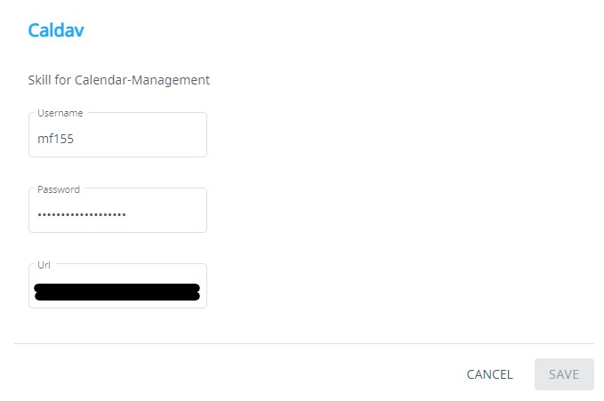

#  Calendar

## About
Calendar app, lets the user create a new appointment

## Getting started
For this skill to work you need to have a working mycroft system.

Type the following commands to install the skill:
```
cd <PATH-TO-MYCROFT-CORE>
source .venv/bin/activate
msm install https://github.com/MitschF/calendar-skill
```

Now open https://account.mycroft.ai/skills and provide the name, password and URL to the skill settings. 

## Tags
#Calendar
#Appoinment
#Event
#Assistant
#Caldav
#Nextcloud

## possible commands to create new events
create event "lecture" at "march 1st"
create event "lecture" at "march 1st" starting at "9" o'clock
create event "lecture" at "march 1st" starting at "9" o'clock till "11" o'clock

create event "today" named "lecture"
create event "today" starting at "9" o'clock with named "lecture"
create event "today" starting at "9" o'clock till "11" o'clock named "lecture"

create event "5 days from now" named "lecture"
create event "5 days from now" starting at "9" o'clock with named "lecture"
create event "5 days from now" starting at "9" o'clock till "11" o'clock named "lecture"

create event on "tuesday" named "lecture"
create event on "tuesday" starting at "9" o'clock named "lecture"
create event on "tuesday" starting at "9" o'clock till "11" o'clock named "lecture"


TODO:
create event "lecture" at "march 1st 2021 9am"
create event "lecture" at "march 1st 2021 9am" till "march 1st 2021 11am"


___
___

# Dokumentation
Voraussetzung für das Nachvollziehen der einzelnen Punkte ist ein korrekt eingerichtetes Mycroft System. Wie das geht, steht [hier](https://github.com/MycroftAI/mycroft-core) beschrieben. 
## Einen Skill anlegen
In der [offiziellen Mycroft Dokumentation](https://mycroft-ai.gitbook.io/docs/skill-development/introduction/your-first-skill#mycroft-skills-kit-msk) stehen die nötigen Schritte zur Erstellung eines ersten eigenen Skills. Wir haben zur Erstellung des Skills gebrauch vom "Mycroft Skills Kit" (MSK) gemacht, welches mit Mycroft installiert wird. 

Der Befehl `mycroft-msk create` in einem Terminal-Fenster führt einen durch die Initialisierung des Skills. Im folgenden Dialog wird nach Name, Beispielsätzen, Antworten, Beschreibung, Kategorien und Tags gefragt. Aus den Antworten erstellt das Programm ein "Skelett" des Skills, welches nun befüllt werden kann.

Zusätzlich wird gefragt, ob ein Github-Repository erstellt werden soll.

## Geheime Variablen
Wir haben einige Daten, die nicht öffentlich zugänglich sein dürfen, wie den Caldav / Nextcloud Benutzernamen, das Passwort und die URL. 

Um es dem Skill zu ermöglichen, auf diese Werte zuzugreifen, gibt es mehrere Möglichkeiten. Naheliegend ist das Auslesen einer Datei, welche nicht im Repository liegt, wie auch das [Nutzen einer .env-Datei](https://github.com/theskumar/python-dotenv). Darüber hinaus gibt es jedoch auch einen Weg, wie der Nutzer die Daten über die Web-Oberfläche anpassen kann.


### .env-Datei
Anfangs war die .env-Datei unser gewählter Weg. Im Repository gab es eine Datei names `default.env`. Der Nutzer des Skills musste die Datei kopieren und die Kopie umbenennen in `.env`. Dort mussten nun die Werte `USERNAME`, `PASSWORD` und `URL` entsprechend angepasst werden. Mithilfe des Python-Moduls `python-dotenv` war es nun möglich, die Werte aus der Datei auszulesen.

Dieser Weg ist jedoch nicht intuitiv und sehr schwer umzusetzen, wenn der Endnutzer sich nicht mit der Bedienung von Computern und Dateien auskennt.

### Mycroft Web-Oberfläche
Aus unserer Sicht ist dies der beste Ansatz. Der anfangs erstellte Skill bringt eine Datei namens `settingsmetadata.yaml` mit. Diese kann der Entwickler anpassen und mit zusätzlichen Feldern versehen. Mycroft erkennt diese Datei und ermöglicht es mit ihrer Hilfe dem User, die entsprechenden Felder über die Web-Oberfläche anzupassen. 

Auszug aus der `settingsmetadata.yaml`:

```yaml
- name: Caldav
      fields:
        - type: label
          label: Skill for Calendar-Management
        - name: username
          type: text
          label: Username
          value: ""
        - name: password
          type: password
          label: Password
          value: ""
        - name: url
          label: Url
          type: text
          value: "https://YOUR.CALENDAR.URL/remote.php/dav"
```

Screenshot der [Weboberfläche](https://home.mycroft.ai/skills):



Auf diese Weise ist es jedem Nutzer einfach möglich, die Zugangsdaten anzupassen, unabhängig vom eigenen technischen Verständnis. Innerhalb des Skills kann man jetzt wie folgt auf die Variablen zugreifen:
```python
USERNAME = self.settings.get('username')
PASSWORD = self.settings.get('password')
URL = self.settings.get('url')

self.client = caldav.DAVClient(url=URL, username=USERNAME, password=PASSWORD)
```

## Hauptaufgabe: Nächsten Termin zurückgeben
Die Hauptaufgabe, die der Skill zu erfüllen hat, ist das Zurückgeben des nächsten Termines, wenn man ihn fragt. 

### Vorüberlegung
Bei der Progammierung einer Funktion für einen Sprachassistenten gibt es verschiedene Überlegungen, die man sich im Voraus machen muss, unter Anderem:
- Wie aktiviere ich die Funktion?
- Gibt es Parameter?
- Was soll der Assitent antworten?

Die Basisaufgabe macht einem die Vorüberlegung relativ einfach.

Die Funktion wird aktiviert durch die Frage nach dem nächsten Termin in Form von **"What's my next appointment?"** Der Nutzer könnte diese Frage jedoch auch auf eine andere Art und Weise stellen, z.B. **"next event"**. 

Es gibt keine Parameter, wie Datum, Uhrzeit oder Anzahl der Antworten, da konkret nach dem **einen** nächsten Termin gefragt wird.

Aber was soll der Assistent antworten? Wir haben uns dafür entschieden, den Namen des nächsten Termins, sowie Datum und bei Bedarf die Uhrzeit zurückzugeben. Eine antwort würde also wie folgt aussehen:
- Wenn der nächste Termin ganztägig ist: **"Next appointment: Christmas on 24. of December, 2021"**
- Wenn der nächste Termin nicht ganztägig ist: **"Next appointment: Lecture on 3. of February, 2021 at 14:15"**

### Programmierung
Bei der Programmierung des Skills haben wir Gebrauch der [Mycroft Skill Struktur](https://mycroft-ai.gitbook.io/docs/skill-development/skill-structure) gemacht. Wichtig sind hier die [__init__.py](https://mycroft-ai.gitbook.io/docs/skill-development/skill-structure#__init__-py), welche die tatsächliche Programmier-Logik beinhaltet, sowie der [locale-Ordner](https://mycroft-ai.gitbook.io/docs/skill-development/skill-structure#vocab-dialog-and-locale-directories), in dem Dateien stehen, welche sich um den Dialog mit Mycroft kümmern. 
#### Dialog (locale-Ordner)
Dateien mit der Endung `.intent` beinhalten Sätze, die der Nutzer sagen soll, damit Mycroft reagiert. Dateien mit der Endung `.dialog` beinhalten Sätze, die Mycroft antwortet. Dann gibt es noch Dateien mit der Endung `.entity`. In dieser wird die "Form" einer Eingabe definiert. Die Entity-Dateien arbeiten immer zusammen mit einer .intent-Datei. [Mehr dazu hier.](https://mycroft-ai.gitbook.io/docs/mycroft-technologies/padatious#creating-entities)

Was der Nutzer sagen muss, um den Skill zu aktivieren steht in der Datei `locale/en-us/what.is.next.intent` geschrieben. Diese beinhaltet folgendes:

```
((what is | what's) (my | the) | ) next (event | appointment)
```

Der Satz oben kann unter anderem aufgelöst werden in: 
- what is my next appointment
- what's the next event
- my next event
- next appointment

Mehr dazu aber später.

#### Programmierlogik (__init__.py)

